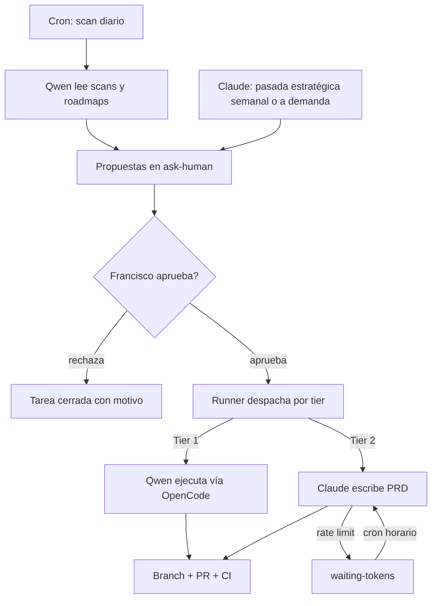

# Orquestación autónoma: el sistema propone, Francisco aprueba

## Summary

Un pipeline autónomo file-based (cron, sin daemon) que genera propuestas de trabajo por sí solo: Qwen produce propuestas diarias de mantenimiento y avance detectable, Claude produce propuestas estratégicas y PRDs con cadencia baja. Francisco solo aprueba en el Kanban; un runner despacha lo aprobado y todo termina en PR con CI verde.

---

## Problem Frame

Mission Control tiene todas las piezas de ejecución (Kanban con columna ask-human, botón Approve, agent-push.sh, CI en los 4 proyectos), pero el flujo documentado en Fase 3 todavía exige que Francisco escriba la instrucción inicial. En la práctica, eso no pasó ni una vez: el cuello de botella no es ejecutar tareas sino **pensarlas**. El dashboard lleva 9 días sin un escaneo porque cada paso del sistema depende de iniciativa humana.

El costo es que el sistema completo queda ocioso: proyectos con branches sin mergear, dependencias desactualizadas y fases de roadmap sin arrancar, sin que nadie lo note hasta abrir cada repo a mano.

Restricción operativa: la suscripción de Claude es básica. Cualquier diseño que dependa de Claude "pensando" a diario consume la cuota en el peor lugar posible y deja la autonomía rehén de los tokens.

---

## Key Decisions

- **Qwen como proposer diario, Claude como proposer estratégico de baja cadencia.** Las propuestas detectables (deps, branches sucios, fases de roadmap sin arrancar) son lectura de datos estructurados y Qwen las puede generar gratis e ilimitado. Claude se reserva para propuestas que requieren criterio y para PRDs, donde su calidad justifica el gasto.
- **Pipeline file-based con cron, no daemon.** Cada etapa lee y escribe JSON en `data/`. Coherente con la filosofía existente (JSON plano, bash, transparencia), debuggeable mirando archivos, sin proceso persistente que mantener. Un daemon queda descartado hasta que el volumen real lo justifique.
- **Manejo de tokens reactivo, no proactivo.** No hay contador de cuota: cuando una llamada a Claude falla por rate limit, la tarea pasa a estado `waiting-tokens` y un cron horario reintenta. Detectar el fallo es robusto; predecir la cuota es frágil.
- **Consolidación antes de autonomía.** El repo tiene código muerto, un commit pendiente, un bug en el scanner y PRs sin mergear. Un sistema autónomo que propone sobre datos falsos genera ruido, no valor. La limpieza es la primera etapa, no una nota al pie.
- **Cadencia híbrida para la pasada estratégica de Claude.** Cron semanal como piso de autonomía, más un botón en el dashboard para pasadas a demanda cuando Francisco quiere input estratégico ya.
- **El dashboard local es la única superficie de aprobación.** Si Francisco no está frente a la máquina, las propuestas esperan. Sin notificaciones ni aprobación remota en esta versión.

---

## Actors

- A1. Francisco — aprueba, rechaza o redirige propuestas desde el Kanban. Única autoridad para que algo pase de propuesta a ejecución.
- A2. Qwen (Ollama, local) — genera propuestas diarias a partir de los scans y ejecuta tareas Tier 1 aprobadas. (Corregido 2026-06-09: el runtime real es la API de Ollama vía `toolbox/run-agent.sh`, no OpenCode como se asumió originalmente.)
- A3. Claude (CLI headless) — genera propuestas estratégicas con cadencia baja y escribe PRDs para tareas Tier 2 aprobadas.
- A4. Pipeline (cron + bash) — escanea proyectos, dispara proposers, despacha tareas aprobadas, reintenta cuando vuelven los tokens.
- A5. Dashboard (Next.js) — superficie de visualización y aprobación; lee y escribe los JSON de `data/`.

---

## Requirements

**Consolidación previa**

- R1. El árbol de trabajo queda limpio: código muerto de la raíz eliminado (`app/`, `components/`, `lib/`, zip del design system), el cambio pendiente de Sidebar commiteado, y los PRs abiertos mergeados o cerrados.
- R2. `scan-projects.sh` extrae una descripción real de cada proyecto (hoy toma la primera línea boilerplate del CLAUDE.md de homeTui).
- R3. El dashboard tiene linting y verificación de tipos en CI, no solo build.

**Propuestas autónomas**

- R4. Un scan diario por cron actualiza `data/` con el estado git/roadmap de todos los proyectos sin intervención humana.
- R5. Qwen genera propuestas de mantenimiento y avance detectable a partir de los scans, escribiéndolas como tareas en estado `ask-human` con proyecto, tipo (Tier) y justificación.
- R6. Claude genera propuestas estratégicas (qué conviene construir, qué replantear) con cadencia híbrida — cron semanal más un botón en el dashboard para pasadas a demanda — escribiéndolas en el mismo formato.
- R7. Las propuestas no se duplican: si una propuesta equivalente ya existe en cualquier estado, no se vuelve a crear.

**Aprobación y despacho**

- R8. Toda propuesta requiere aprobación explícita de Francisco en el Kanban antes de ejecutarse; no existe ruta de auto-aprobación.
- R9. Un runner por cron detecta tareas aprobadas y las despacha según tier: Tier 1 a Qwen vía Ollama, Tier 2 a Claude para PRD.
- R10. Toda ejecución termina en branch + PR con CI, nunca en push directo a main (convención agent-push.sh).
- R11. El resultado de cada ejecución (éxito, fallo, PR creado) queda registrado en la tarea y visible en el dashboard.

**Manejo de tokens**

- R12. Cuando una llamada a Claude falla por límite de cuota, la tarea pasa a estado `waiting-tokens` sin perder contexto.
- R13. Un cron horario reintenta las tareas en `waiting-tokens`; al volver la cuota, el flujo continúa solo.

**Registro y sincronización**

- R14. El progreso del sistema se refleja en las tres superficies acordadas: roadmap del CLAUDE.md, vault de Obsidian y GitHub.

---

## Key Flows

- F1. Loop diario de propuestas
  - **Trigger:** cron diario.
  - **Steps:** scan actualiza `data/` → Qwen analiza scans y roadmaps → escribe propuestas nuevas (sin duplicar) en `ask-human` → el dashboard las muestra a la mañana.
  - **Outcome:** Francisco abre el dashboard y encuentra trabajo propuesto, no un tablero vacío.
  - **Covers:** R4, R5, R7.
- F2. Aprobación y ejecución Tier 1
  - **Trigger:** Francisco aprueba una propuesta de mantenimiento.
  - **Steps:** runner detecta la aprobación → despacha a Qwen vía Ollama → Qwen ejecuta en branch → PR con CI → resultado registrado en la tarea.
  - **Outcome:** PR listo para revisar sin que Francisco haya escrito una sola instrucción.
  - **Covers:** R8, R9, R10, R11.
- F3. Aprobación Tier 2 con agotamiento de tokens
  - **Trigger:** Francisco aprueba una propuesta estratégica y la cuota de Claude está agotada.
  - **Steps:** runner despacha a Claude → la llamada falla por rate limit → tarea pasa a `waiting-tokens` → cron horario reintenta → al volver la cuota, Claude escribe el PRD y el flujo sigue.
  - **Outcome:** el sistema se recupera solo; Francisco no necesita enterarse del corte.
  - **Covers:** R9, R12, R13.

---

## Acceptance Examples

- AE1. **Covers R7.** Given una propuesta "actualizar deps de carApp" en estado `ask-human`, when el proposer corre al día siguiente y detecta la misma condición, then no crea una segunda tarea.
- AE2. **Covers R12, R13.** Given una tarea Tier 2 aprobada y cuota de Claude agotada, when el runner la despacha y falla, then la tarea queda en `waiting-tokens` con su contexto intacto y el reintento horario la completa cuando vuelve la cuota — sin intervención de Francisco.
- AE3. **Covers R8.** Given una propuesta en `ask-human` que nadie aprueba durante días, when corren los crons, then la propuesta sigue esperando: ningún mecanismo la ejecuta ni la escala automáticamente.
- AE4. **Covers R5.** Given que Francisco rechaza una propuesta con motivo, when el proposer corre de nuevo, then la propuesta rechazada no reaparece idéntica.

---

## Scope Boundaries

**Deferred for later**

- Daemon persistente con despacho instantáneo — solo si el volumen diario de tareas lo justifica.
- Notificaciones y aprobación remota — el dashboard local es la única superficie por ahora.
- Métricas de uso de cuota o predicción proactiva de tokens.

**Outside this product's identity**

- Auto-aprobación de cualquier tipo, incluso para tareas "seguras". El protocolo Ask To Human es identidad del sistema, no una limitación temporal.

---

## Dependencies / Assumptions

- ~~OpenCode permite invocar a Qwen de forma headless/scriptable desde bash~~ Resuelto en planning: Qwen ya corre headless vía la API de Ollama (`toolbox/run-agent.sh`, `localhost:11434`); OpenCode no participa.
- El CLI de Claude permite ejecución headless (`claude -p`) bajo la suscripción actual, y sus fallos por rate limit son detectables desde el script.
- El vault de Obsidian vive en el disco Barracuda, que a veces no está montado — los pasos que leen/escriben el vault deben tolerar su ausencia sin romper el pipeline.
- Francisco revisa el dashboard aproximadamente a diario; las propuestas pueden esperar sin costo.

---

## Outstanding Questions

**Deferred to Planning**

- Formato exacto del prompt/contexto que recibe Qwen como proposer (qué archivos lee, cómo se le presentan los scans).
- Cómo se detecta el rate limit de Claude desde bash (código de salida, mensaje en stderr).
- Si el cron corre como systemd timer o crontab de usuario.
