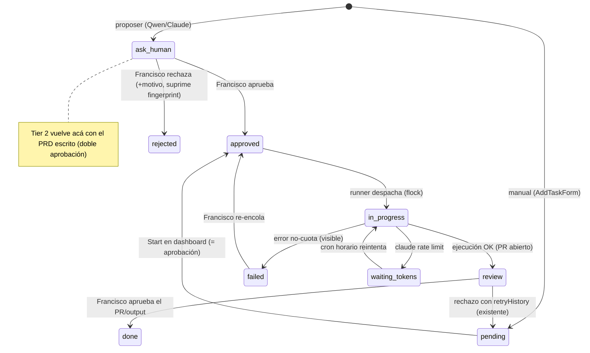

# feat: Orquestación autónoma

## Summary

Pipeline file-based (cron + bash + JSON) que propone trabajo solo: bash detecta condiciones deterministas, Qwen (Ollama local) redacta propuestas en `ask-human`, Francisco aprueba en el Kanban, y un runner con lock despacha — Tier 1 a Qwen en worktrees aislados, Tier 2 a `claude -p` headless (Sonnet por defecto, Opus solo crítico). Todo termina en branch + PR. Rate limit de Claude → `waiting-tokens` + reintento horario.

---

## Problem Frame

El flujo de ejecución existe pero nunca se usó: el cuello de botella es pensar las tareas, no ejecutarlas (ver origin). La investigación reveló además que el camino "Qwen ejecuta → PR" no existe hoy: `toolbox/run-agent.sh` guarda texto y `applyAgentFiles` (`dashboard/app/actions.ts`) escribe directo al working tree y marca `done` sin PR — violando R10. Los agentes operan sobre los directorios vivos de Francisco, y `tasks.json` se escribe sin locking desde dashboard y scripts.

---

## Key Technical Decisions

- **Bash detecta, Qwen redacta.** Las condiciones (deps, branches sucios, stale, fases de roadmap sin arrancar) se detectan en bash con fingerprints deterministas (`projectId+tipo+condición`). Qwen solo convierte condiciones en texto de propuesta. Hace cumplible la deduplicación (R7/AE1) y la supresión de rechazadas (AE4); detección semántica por LLM era frágil.
- **Worktrees aislados para toda ejecución de agentes.** `git worktree` por tarea bajo un scratch dir. Nunca sobre `~/Documents/projects/<id>` vivo — un runner autónomo arrastraría WIP de Francisco a PRs de agentes. (Estándar global ya lo exige para agentes paralelos.)
- **Reemplazo de `applyAgentFiles`.** El apply directo al working tree desaparece; los file blocks de Qwen se aplican en el worktree y se pushean vía `agent-push.sh` parametrizado. Reemplazar, no deprecar.
- **Ollama reemplaza a OpenCode como runtime de Qwen.** El origin asumía OpenCode; la investigación mostró que `toolbox/run-agent.sh` ya invoca la API de Ollama (`localhost:11434`). Toda referencia Tier 1 es Ollama; el doc de requisitos queda corregido en A2/R9/F2.
- **`agents.json` se elimina.** Con `prUrl`, `error`, `attempts` y estados en la tarea, el ledger paralelo de `AgentSession` pierde su única función y quedaría como estado huérfano sin lock. La UI de agentes del dashboard (Sidebar, AgentBadge, AgentQueue, `/api/agents`) pasa a derivar de tareas en `in-progress`/`waiting-tokens`. Replace, don't deprecate.
- **Política de modelos por criticidad.** `claude -p --model claude-sonnet-4-6` por defecto (estratégica, PRDs); `claude-opus-4-8` solo cuando Francisco marca la tarea como crítica al aprobar — nunca auto-seleccionado; `claude-haiku-4-5` para pasadas mecánicas baratas. Decisión de origen + revisión de Francisco 2026-06-09.
- **Clasificación de fallos de `claude -p`.** Solo patrones de rate limit en stderr/exit → `waiting-tokens` (reintento horario); todo lo demás (auth vencida, red, prompt) → `failed` visible en dashboard. La forma exacta del error no está documentada — se valida empíricamente (U10). Sin contadores proactivos de cuota: no existen para Pro.
- **Doble aprobación en Tier 2.** Propuesta aprobada → Claude escribe PRD → el PRD vuelve a `ask-human`; ejecutar sin segunda aprobación sería auto-aprobación de scope, fuera de la identidad del producto (ver origin, Scope Boundaries).
- **Escrituras atómicas + lock de runner.** Todo escritor de `tasks.json` usa staging + `mv` atómico; el runner corre bajo `flock` para impedir doble despacho (cron horario + diario + botón concurrentes).
- **systemd user timers con `Persistent=true`**, no crontab: ejecuta jobs perdidos al despertar la máquina (hazard real: la máquina no está siempre prendida).
- **Supresión de rechazos por condición, no por tiempo.** Un fingerprint rechazado no se re-propone hasta que el valor de la condición subyacente cambie.
- **IDs de tareas por timestamp** (`task-YYYYMMDD-HHMMSS-rand`), no `length+1` (colisiona con los `mc-NNN`/`homeTui-NNN` existentes al podar).

---

## High-Level Technical Design

Máquina de estados de tareas (extiende la existente; estados nuevos en negrita conceptual):

Flujo diario: `scan.timer` → `scan-projects.sh` (+`sync-obsidian.sh` best-effort) → `detect-conditions.sh` (fingerprints) → `propose.sh` (Qwen redacta → staging → validación bash → merge atómico) → dashboard muestra `ask-human`. Runner: `runner.timer` (horario) → `flock` → despacha `approved` por tier y reintenta `waiting-tokens`.

---

## Implementation Units

### Etapa A — Consolidación (bloqueante)

### U1. Limpieza del repo y commit pendiente

- **Goal:** Árbol limpio y verdadero antes de automatizar (R1).
- **Requirements:** R1.
- **Dependencies:** ninguna.
- **Files:** eliminar `app/`, `components/`, `lib/` de la raíz (output de Qwen mal aplicado — causa: `applyAgentFiles` une paths al root del proyecto, no a `dashboard/`); `Mission Control Design System.zip` (mover fuera del repo o extraer a `dashboard/` si tiene valor; decidir con Francisco antes de borrar); commitear `dashboard/components/Sidebar.tsx` (integración AgentQueue) y `dashboard/pnpm-workspace.yaml`; reescribir `dashboard/README.md` (boilerplate → setup/run/arquitectura reales); `.gitignore`.
- **Approach:** verificar contra `git status`; mergear o cerrar PRs abiertos en GitHub (#4/#5 según estado real — verificar con `gh pr list`). Usar `trash`, nunca `rm -rf`.
- **Test scenarios:** Test expectation: none — limpieza y commit; verificación por `git status` limpio y CI verde en main.
- **Verification:** `git status` sin untracked inesperados; `main` actualizado con los PRs resueltos; README del dashboard describe el proyecto real.

### U2. Fix de extracción de descripciones en scan-projects.sh

- **Goal:** Descripciones reales por proyecto (R2) — hoy homeTui/personalDashboard muestran el boilerplate de CLAUDE.md.
- **Requirements:** R2, R4.
- **Dependencies:** ninguna.
- **Files:** `toolbox/scan-projects.sh` (función `extract_description`, líneas ~11–38).
- **Approach:** el fallback `awk` toma la primera línea no-heading — que en CLAUDE.md estándar es el boilerplate. Saltear líneas que matcheen el boilerplate conocido y preferir el primer párrafo después del primer `#` título, o la sección `## Problema`/`## What This Is`.
- **Test scenarios:** correr el scan y verificar que homeTui ya no muestra "This file provides guidance..."; proyecto sin CLAUDE.md → descripción vacía sin romper; CLAUDE.md con solo headings → cae a vacío.
- **Verification:** `data/projects.json` con descripciones reales para los 4 proyectos.

### U3. Lint en CI

- **Goal:** CI con lint además de tsc+build (R3).
- **Requirements:** R3.
- **Dependencies:** ninguna.
- **Files:** `dashboard/package.json` (devDependency `oxlint` pinneada exacta + script `lint`), `.github/workflows/ci.yml` (job `lint` clonando la estructura del job typecheck; sumar `shellcheck toolbox/*.sh` en el mismo job — con `working-directory: .` explícito en ese step, porque el workflow defaultea todos los runs a `dashboard/`).
- **Approach:** copiar la receta pnpm ya debuggeada del workflow (4 commits de fixes — no re-derivar). Buscar versión estable actual de oxlint antes de pinnear.
- **Test scenarios:** CI falla ante un error de lint introducido a propósito (verificar que el test atrapa); pasa en el estado actual tras corregir lo que aparezca.
- **Verification:** los 3 jobs verdes en un PR de prueba.

---

### Etapa B — Esquema y datos frescos

### U4. Esquema de tareas extendido, estados nuevos y escrituras atómicas

- **Goal:** El contrato entre los cinco actores (dashboard, scripts, proposer, runner, Francisco) — base de todo lo demás.
- **Requirements:** R5, R8, R11, R12 (habilita R7, R9, R10 y R13 vía las unidades dependientes que los implementan).
- **Dependencies:** ninguna (paralelo a Etapa A).
- **Files:** `dashboard/lib/data.ts` (union de `Task["status"]` + campos nuevos), `toolbox/update-task-status.sh` (regex de validación), `dashboard/app/actions.ts` (reemplazar el helper `writeTasks` por staging+`mv` atómico cubriendo los seis call sites existentes — `addTask`, `updateTaskStatus`, `spawnAgent`, `updateAgentStatus`, `rejectAgent`, `approveTask` — no solo las acciones nuevas; separar `approveProposal` —ask-human→approved— de `approveTask` —review→done—; campo `critical` al aprobar), `dashboard/components/TaskBoard.tsx`, `dashboard/components/TaskList.tsx` (estados visibles, incl. `waiting-tokens` con contador de intentos y `failed` con error).
- **Approach:** estados nuevos: `approved`, `waiting-tokens`, `failed`, `rejected` (terminal, retiene fingerprint como ledger). Campos nuevos: `tier`, `justification`, `fingerprint`, `prUrl`, `error`, `critical`, `attempts`. `source` suma `"proposer"`. Las tareas manuales reciben `tier: 1` por defecto al crearse. Todos los escritores (TS y bash) pasan a staging+`mv`. Las tareas `done`/`rejected` se retienen (ledger de dedup — excepción consciente a "historial truncado"). El tipo `AgentSession` y `data/agents.json` se eliminan (ver Key Technical Decisions); la UI de agentes deriva de los estados de tareas.
- **Test scenarios:** `update-task-status.sh` acepta los estados nuevos y rechaza inventados; transición inválida (p.ej. `rejected`→`in-progress`) bloqueada; escritura concurrente simulada (dos writers) no corrompe el JSON (el último gana, archivo siempre parseable); Kanban renderiza columnas/estados nuevos sin romper con tasks.json viejo (campos opcionales).
- **Verification:** `tsc --noEmit` verde; tasks.json existente sigue cargando sin migración manual.

### U5. Scan diario por systemd timer + tolerancia a vault ausente

- **Goal:** Datos frescos sin intervención (R4); el pipeline no muere si Barracuda no está montado.
- **Requirements:** R4, R14.
- **Dependencies:** U2.
- **Files:** `toolbox/systemd/mc-scan.service` + `mc-scan.timer` (user units, `Persistent=true`), `toolbox/install-timers.sh` (instalador único de TODOS los timers del sistema — U8 y U11 agregan sus unit files al directorio que este script enumera, sin instaladores propios; incluye `loginctl enable-linger` para que los user timers corran sin sesión activa), `toolbox/sync-obsidian.sh` (hoy `exit 1` si no encuentra el vault — pasar a skip con log; corregir el path hardcodeado `~/Documents/Obsidian Vault` → vault real en Barracuda, con chequeo de montaje), `toolbox/scan-projects.sh` (verificar que el `lastScanned` por proyecto ya existente sirve como fuente del guard de staleness de U7 — ya se escribe hoy, no re-implementar).
- **Approach:** timer diario; el service corre scan + sync best-effort. Guard de staleness queda para el proposer (U7).
- **Test scenarios:** timer instalado y un disparo manual (`systemctl --user start mc-scan`) actualiza `data/`; con Barracuda desmontado el service termina OK con skip logueado (Covers supuesto del origin); con vault montado genera los `-obsidian.json`.
- **Verification:** `systemctl --user list-timers` muestra el timer; `lastScanned` se mueve solo al día siguiente.

---

### Etapa C — Proposer

### U6. Detector de condiciones con fingerprints

- **Goal:** Condiciones deterministas que alimentan propuestas (R5, R7).
- **Requirements:** R5, R7.
- **Dependencies:** U4, U5.
- **Files:** `toolbox/detect-conditions.sh` (nuevo) → escribe `data/scans/conditions.json`.
- **Approach:** condiciones v1: branch con commits sin push >2 días, dirty files >3 días, último commit >7 días en proyecto activo, fase de roadmap sin arrancar (checkboxes del CLAUDE.md/ROADMAP), PR abierto sin actividad (vía `gh`). Cada condición emite `{projectId, type, value, fingerprint}`. Fingerprint = `projectId:type:clave`, donde la clave y el valor de supresión derivan SIEMPRE del objeto subyacente, nunca del tiempo transcurrido (tres de las cinco condiciones v1 son de tiempo y cambiarían cada día, haciendo reaparecer rechazos): commits sin push → branch + sha de HEAD; dirty files → hash de la lista de archivos; commit stale → sha del último commit; fase de roadmap → identificador de fase; PR inactivo → número + head sha.
- **Test scenarios:** repo de fixture con commits sin push → emite la condición esperada con fingerprint estable en dos corridas; condición resuelta → desaparece; condición de tiempo rechazada NO se re-emite al día siguiente cuando solo cambió el tiempo transcurrido, SÍ se re-emite tras un commit nuevo sin push (Covers AE4); `gh` sin red → esa condición se saltea con log, el resto sigue (Covers F1).
- **Verification:** `conditions.json` validable con `python3 -m json.tool`; fingerprints idempotentes.

### U7. Proposer Qwen con validación y merge atómico

- **Goal:** Propuestas en `ask-human` redactadas por Qwen, sin corromper `tasks.json` (R5, R6 formato, R7, AE1, AE4).
- **Requirements:** R5, R7. Covers AE1, AE4, F1.
- **Dependencies:** U6.
- **Files:** `toolbox/propose.sh` (nuevo; modelado sobre `run-agent.sh`: Ollama API, temp baja), `data/agent-rules.md` (sección proposer).
- **Approach:** bash filtra condiciones nuevas (fingerprint sin tarea existente en ningún estado, y no suprimido por rechazo con condición sin cambio); Qwen recibe solo las condiciones filtradas y devuelve título+justificación por condición a un staging file; bash valida (projectIds conocidos, campos permitidos, JSON parseable — si Qwen devuelve basura, se descarta esa propuesta con log, nunca se mergea); merge atómico a `tasks.json` con IDs timestamp. Cap de condiciones por corrida (constante configurable al tope del script, ~10): las que exceden el cap no se descartan — quedan para el próximo ciclo, donde el filtro de fingerprints las deja pasar. Guard: abortar si `lastScanned` >24h.
- **Test scenarios:** Covers AE1 — condición ya propuesta no genera segunda tarea; Covers AE4 — fingerprint rechazado con condición igual no reaparece, con condición cambiada sí; output malformado de Qwen → propuesta descartada, tasks.json intacto; Ollama caído → exit con log, sin tocar tasks.json; scan stale → aborta.
- **Verification:** corrida nocturna real produce 1+ propuestas legítimas en el Kanban.

---

### Etapa D — Runner y ejecución

### U8. Runner con flock, worktrees y camino branch+PR

- **Goal:** Despachar `approved` de punta a punta hasta PR (R9, R10, R11). El reemplazo de `applyAgentFiles`.
- **Requirements:** R9, R10, R11. Covers F2.
- **Dependencies:** U4.
- **Files:** `toolbox/runner.sh` (nuevo, entrypoint bajo `flock`), `toolbox/run-agent.sh` (ejecutar contra worktree; registrar fallo en la TAREA, no solo en el agente — bug existente), `toolbox/agent-push.sh` (parametrizar identidad/prefijo de branch; sufijo de intento `qwen/<task-id>-r<N>` para reintentos; operar desde el worktree), `toolbox/systemd/mc-runner.{service,timer}` (horario; instalación vía `install-timers.sh` de U5), `dashboard/app/actions.ts` (retirar `applyAgentFiles`; `startTask` deja de ejecutar `run-agent.sh` directo — pasa a transicionar `pending`→`approved`, el click en Start ES la aprobación con flag `critical` opcional, y el runner queda como único despachador; `AgentReview` pasa a revisar el PR/diff), `dashboard/components/Sidebar.tsx`, `dashboard/components/AgentBadge.tsx`, `dashboard/components/AgentQueue.tsx`, `dashboard/app/api/agents/` (derivar la vista de agentes de los estados de tareas; eliminar `data/agents.json`).
- **Approach:** por tarea aprobada: `git worktree add` desde `origin/main` en scratch dir → run-agent aplica file blocks ahí → `git add` → commit+push+PR vía agent-push (que exige cambios staged) → task `review` con `prUrl` → worktree se limpia. El aplicador de file blocks es código nuevo (hoy el parser vive solo en el dashboard TS) con regla explícita de path-root por proyecto: resolver cada path emitido contra la raíz del repo, y si el proyecto declara subdirectorio de app (missionControl → `dashboard/`), prefijar los paths que matcheen el layout de app (`app/`, `components/`, `lib/`); rechazar todo block cuyo path resuelto escape el worktree. Per-proyecto serializado. Recovery: `in-progress` >2h sin agente vivo → `failed` con motivo; el timestamp de `in-progress` se resetea en cada redespacho (incluido el reintento desde `waiting-tokens`) para que el reloj mida el despacho real, no la aprobación original.
- **Test scenarios:** tarea aprobada con working dir del proyecto SUCIO → el PR no contiene el WIP de Francisco (Covers hallazgo crítico); dos corridas concurrentes del runner → flock impide doble despacho; retry tras rechazo → branch `-r2` sin colisión; fallo de Qwen → task `failed` con error visible (no `in-progress` zombie); PR creado queda registrado en `prUrl` (Covers F2, R11); Qwen emite `components/X.tsx` para missionControl → el archivo aterriza en `dashboard/components/` en el PR; tarea manual `pending` iniciada desde el dashboard → la toma el próximo pase del runner en un worktree; tarea que pasó por `waiting-tokens` y supera 2h de wall-clock → NO se marca `failed` (el reloj se reseteó en el redespacho).
- **Verification:** un PR real abierto por el runner sin intervención manual.

### U9. Validación E2E Tier 1

- **Goal:** El loop completo probado con una tarea real (criterio de Fase 3 del doc de orquestación, orch-010).
- **Requirements:** Covers F1+F2 encadenados.
- **Dependencies:** U7, U8.
- **Files:** ninguno nuevo — ejecución del pipeline + nota de resultados en el vault.
- **Approach:** dejar que el ciclo proponga, aprobar una propuesta chica real, observar hasta PR con CI verde. Documentar fricciones en el vault (orch-011) — esto cubre la pata vault de R14; las patas CLAUDE.md y GitHub de R14 son convención de sesión (cada sesión que avanza el sistema actualiza roadmap y pushea), no unidades de este plan.
- **Test scenarios:** Test expectation: none — es la validación misma.
- **Verification:** propuesta → aprobación → PR con CI verde, cero instrucciones escritas por Francisco.

---

### Etapa E — Claude estratégico y tokens

### U10. Wrapper claude-headless con política de modelos y clasificación de fallos

- **Goal:** Invocar `claude -p` de forma segura desde cron, con detección empírica de rate limit (R12, R13).
- **Requirements:** R12, R13. Covers AE2, F3.
- **Dependencies:** U4.
- **Files:** `toolbox/claude-headless.sh` (nuevo).
- **Approach:** wrapper con `--output-format json`, modelo por parámetro (default `claude-sonnet-4-6`; `claude-opus-4-8` solo si la tarea tiene `critical`; `claude-haiku-4-5` para pasadas mecánicas), prompt desde archivo, salida a archivo. Clasificación: exit≠0 + stderr/json matcheando patrones de rate limit/usage limit → `waiting-tokens` + `attempts++`; cualquier otro fallo → `failed` con el error guardado. **Primer paso: probe empírico** — agotar/esperar el límite y capturar la forma real del error (exit code, stderr, JSON) antes de fijar los patrones; documentar el hallazgo en el plan/vault. El smoke test de 5 horas de esta sesión alimenta esto.
- **Test scenarios:** Covers AE2 — simulación de rate limit (patrón inyectado) → `waiting-tokens` y reintento posterior continúa; auth inválida simulada → `failed`, NO `waiting-tokens`; éxito → output JSON parseado y guardado; tarea `critical` → se invoca opus, sin flag → sonnet.
- **Verification:** corrida real bajo cuota agotada transiciona a `waiting-tokens` y se recupera sola al volver la cuota.

### U11. Pasada estratégica (semanal + botón) y PRD Tier 2 con doble aprobación

- **Goal:** Propuestas de criterio y PRDs, con la segunda aprobación obligatoria (R6, R8, R9 Tier 2).
- **Requirements:** R6, R8, R9. Covers F3, AE3.
- **Dependencies:** U7, U10.
- **Files:** `toolbox/strategic-pass.sh` (nuevo: contexto = projects.json + conditions + roadmaps → claude-headless → propuestas al mismo staging/validación de U7), `toolbox/systemd/mc-strategic.timer` (semanal; instalación vía `install-timers.sh` de U5), `dashboard/components/StrategicPassButton.tsx` (nuevo) + `dashboard/app/actions.ts` (server action que dispara el script; botón deshabilitado mientras corre), runner (U8) extiende: `approved` Tier 2 → claude-headless escribe PRD en `data/prds/<id>.md` → task vuelve a `ask-human` con el PRD linkeado. `strategic-pass.sh` usa su PROPIO archivo de flock (no el del runner — compartirlo bloquearía el runner horario durante una llamada a Claude de varios minutos); cubre cron + botón concurrentes. Fingerprints Tier 2: `projectId:strategic:<slug-del-título-normalizado>` asignados en la validación, y el prompt incluye los títulos de propuestas estratégicas abiertas/rechazadas como contexto do-not-repeat (R7/AE4 para propuestas sin condición determinista).
- **Approach:** la pasada estratégica usa sonnet; PRDs usan sonnet salvo `critical`. La ejecución post-PRD aprobado baja al camino Tier 1 (U8) con el PRD como contexto.
- **Test scenarios:** Covers AE3 — propuesta sin aprobar queda esperando indefinidamente, nada la ejecuta; PRD escrito → task en `ask-human` (NO ejecuta sin segunda aprobación); botón durante pasada activa → no-op con feedback; dos pasadas estratégicas consecutivas → no duplican una propuesta abierta; rate limit en mitad de la pasada → `waiting-tokens` (vía U10).
- **Verification:** un ciclo Tier 2 completo: propuesta → aprobación → PRD → segunda aprobación → PR.

---

## Scope Boundaries

**Deferred for later** (del origin): daemon persistente; notificaciones/aprobación remota; métricas/predicción de cuota.

**Outside this product's identity** (del origin): auto-aprobación de cualquier tipo — incluye ejecutar un PRD sin segunda aprobación.

### Deferred to Follow-Up Work
- Migrar `addTask` manual a IDs timestamp (mismo patrón que U4) si molesta en la práctica.
- `actionlint`/`zizmor` sobre los workflows en CI.
- Edit-before-approve de propuestas en el Kanban (v1: rechazar + crear manual).
- Primer entry de `docs/solutions/` (receta pnpm CI + reglas anti-elisión de Qwen) — el directorio no existe aún.

---

## Risks

- **`claude -p` headless en suscripción Pro no es caso de uso documentado/soportado** — el formato de error puede cambiar sin aviso. Mitigación: probe empírico (U10), patrones de detección en un solo archivo, fallback conservador a `failed` (visible) ante lo no reconocido.
- **Calidad de propuestas de Qwen 14B** — ruido inicial esperable. Mitigación: bash decide QUÉ proponer (condiciones), Qwen solo redacta; validación dura antes del merge.
- **Single-machine**: si la máquina está apagada no pasa nada — aceptado; `Persistent=true` recupera al despertar.

---

## Open Questions (deferred to implementation)

- Forma exacta del error de rate limit de `claude -p` (se resuelve con el probe del smoke test).
- Si `gh` rate-limitea el detector de condiciones con 4 repos (improbable; degradar con log).
- Umbral exacto de staleness/recovery (defaults: 24h scan, 2h in-progress).

---

## Sources & Research

- Origin: `docs/brainstorms/2026-06-09-autonomous-orchestration-requirements.md` (R1–R14, F1–F3, AE1–AE4).
- Repo research 2026-06-09: Qwen corre vía API de Ollama (`toolbox/run-agent.sh`), no OpenCode — corrige supuesto del origin; `applyAgentFiles` aplica al root del proyecto (causa del código muerto en la raíz); ningún writer de `tasks.json` tiene locking; receta pnpm de CI ya debuggeada en `b6f919c..966d1d4` — copiar, no re-derivar.
- Claude Code headless (claude-code-guide, 2026-06-09): sin endpoint de cuota para Pro — try-and-detect; `--output-format json`, `--model`, `--no-session-persistence` para cron; formato de error de rate limit no documentado.
- Flow analysis 2026-06-09: máquina de estados extendida, worktrees, doble aprobación Tier 2, clasificación de fallos, flock, branches con sufijo de intento, ledger de fingerprints.
- Vault: nota `Mission Control - Orchestration` (tiers, convenciones, fases orch-001..017) — este plan implementa Fases 2–4 de ese doc con la capa proposer nueva.
